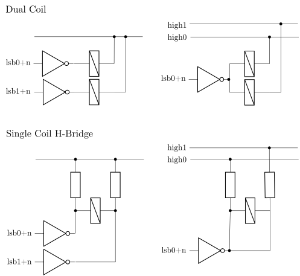

# GPIO Volume Control

GPIO Volume Control allows you to use GPIO pins via GPIO expanders to control external hardware such as relay-based attenuators or LED bar graphs.

## Configuration

Configure via the web interface under NVS Editor with the key `gpio_volume`:
```
mode=<mode>,lsb0=<pin>[:level],width=<bits>[,lsb1=<pin>[:level]][,high0=<pin>[:level],high1=<pin>[:level]][,dacmaxvol=<0|1>][,time=<ms>][,loud=<0|1>]
```

### Required Parameters

- **`mode`** - Operating mode:
  - `binary` - Direct binary output (default)
  - `ledbar` - LED bar graph display
  - `latching` - Latching relay control

- **`lsb0=<pin>[:level]`** - First (LSB) GPIO pin number (cf. GPIO expander config)
  - Optional `:level` suffix specifies active level (0 or 1, default: 1, only in mode latching)
  - Examples: `lsb0=64` (uses default level 1), `lsb0=64:0` (active low)

- **`width`** - Number of bits/pins to use (5-16 typical)

### Optional Parameters

- **`dacmaxvol`** - DAC volume control:
  - `0` - Normal DAC volume control (default)
  - `1` - Force DAC to maximum, use only GPIO for volume

- **`lsb1=<pin>[:level]`** - Second GPIO bank for latching mode A (two outputs per relay)
  - Optional `:level` suffix specifies active level (0 or 1, default: 1)
  - Example: `lsb1=72:1`

- **`high0=<pin>[:level]`**, **`high1=<pin>[:level]`** - Control rails for latching mode B (high side outputs control supply voltage to either "set" or "unset" configuration)
  - Optional `:level` suffix specifies active level (0 or 1, default: 1)
  - Examples: `high0=70:1,high1=71:0`

- **`time`** - Pulse duration in milliseconds for latching relays (default: 10)

- **`loud`** - Determines whether an active output increases or decreases the volume, equivalent to active level for outputs in binary/LED bar modes:
  - `1` - Active output increases volume (default)
  - `0` - Active output decreases volume

## Operating Modes

### Binary Mode

Outputs volume as a binary number across the GPIO pins. Volumes 0 ... 100 are mapped to 0 ... 2^(width) - 1.

**Example:** 6-bit binary (64 steps)
```
mode=binary,lsb0=64,width=6
```

GPIO 64 ... 69 will output binary values 0 ... 63 representing volume levels.

**Example with low outputs increasing the volume:**
```
mode=binary,lsb0=64,width=6,loud=0
```

### LED Bar Mode

Displays volume as a bar graph. Volume 0 ... 100 determines how many LEDs light up.

**Example:** 8 LED bar graph
```
mode=ledbar,lsb0=64,width=8,loud=1
```

At 50% volume, LEDs on GPIO 64 ... 67 will be lit (4 out of 8).

**Example with active low LEDs:**
```
mode=ledbar,lsb0=64,width=8,loud=0
```

### Latching Mode

Controls latching relays that maintain their state after a pulse. Relays can either be dual coil or single coil in an H-bridge configuration. Two sub-modes:

#### Mode A: Two Outputs per Relay (requires lsb1)

Each relay is set/unset by a separate output. One GPIO bank pulses "loud", another pulses "quiet".

**Example:**
```
mode=latching,lsb0=64,lsb1=72,width=6,time=10
```

- GPIO 64 ... 69: "Set to quiet" outputs
- GPIO 72 ... 77: "Set to loud" outputs
- Pulse duration: 10ms

**Example with active low relay drivers:**
```
mode=latching,lsb0=64:0,lsb1=72:0,width=6,time=10
```

This would even allow mixing different driver circuits with opposite active levels.

#### Mode B: Matrix Configuration - One Output per Relay plus Two Supply Outputs (requires high0, high1)

Relays toggle state based on which control rail is active. lsb0 and following determine which relays are selected, the supply rails high0 and high1 determine whether a relay is set or unset.

**Example:**
```
mode=latching,lsb0=64,width=6,high0=70,high1=71,time=10
```

- GPIO 64 ... 69: Relay select lines
- GPIO 70: "Set to quiet" rail
- GPIO 71: "Set to loud" rail

**Example with inverted rail polarity:**
```
mode=latching,lsb0=64,width=6,high0=70:0,high1=71:0,time=10
```
This accommodates different H-bridge driver configurations where rails may have any active levels.



## Level Configuration Details

The `:level` suffix allows you to specify the active logic level for each GPIO pin or bank:

- **`:1`** - Active high (pin goes HIGH to activate, default)
- **`:0`** - Active low (pin goes LOW to activate)

This is particularly useful when:
- Using different driver circuits with opposite logic (e.g., PNP vs NPN transistors)
- Interfacing with relay drivers that have inverted inputs
- Mixing active-high and active-low components in the same circuit

If no level is specified, the default is `:1` (active high).

## Volume Mapping

The system receives volume as a 16-bit gain value from LMS (Logitech Media Server) which uses a logarithmic dB scale. This is converted to a linear 0-100 volume scale internally, then mapped to the configured GPIO outputs.

## Hardware Considerations

- **GPIO Expanders Required**: All GPIO numbers must be expander GPIOs (GPIO_NUM_MAX or higher)
- **Relay Driver**: Relay currents may be too much for your port expander, consider using a darlington driver like ULN2803
- **Flyback Diode**: Protect your driver from inductive spikes from switching relay coils by adding flyback diodes (ULN2803 has built-in diodes)
- **Startup Synchronization**: Latching relays are synchronized to the correct position on startup
- **Relay Set/Reset Time**: Time parameter should be tuned for your specific relay hardware (typically 5-20ms)
- **Power Supply**: Ensure adequate current for driving multiple relays/LEDs
- **Level Matching**: Use the `:level` suffix to match your driver circuit polarity

## Example Configurations

### Simple 6-bit resistor ladder (R-2R DAC):
```
mode=binary,dacmaxvol=1,lsb0=64,width=6
```

### 6-bit with active-low outputs:
```
mode=binary,dacmaxvol=1,lsb0=64,width=6,loud=0
```

### 10-LED volume display:
```
mode=ledbar,dacmaxvol=0,lsb0=64,width=10,loud=1
```

### 10-LED with active-low driver:
```
mode=ledbar,dacmaxvol=0,lsb0=64,width=10,loud=0
```

### Latching relays in matrix config:
```
mode=latching,dacmaxvol=1,lsb0=64,width=7,high0=73,high1=74,time=8
```

### Latching relays in matrix config with inverted rail:
```
mode=latching,dacmaxvol=1,lsb0=64:1,width=7,high0=73:0,high1=73:0,time=8
```

### Latching relays with separate set/reset drivers:
```
mode=latching,dacmaxvol=1,lsb0=64,lsb1=72,width=6,time=12
```

### Latching relays with mixed polarity drivers:
```
mode=latching,dacmaxvol=1,lsb0=64:1,lsb1=72:0,width=6,time=12
```

This configuration may be useful when using different driver ICs for the two banks that have opposite logic levels.

## Troubleshooting

- **No output**: Check that GPIO expander is properly configured in `gpio_exp_config`
- **Wrong polarity**: Adjust the `:level` suffix on pin configurations or the `loud` parameter
- **Latching relays not firing**: Increase `time` parameter (try values from 5-20ms)
- **Relays clicking but not changing state**: Check `:level` configuration matches your driver polarity
- **Volume jumps**: Check that `width` matches your hardware bit depth
- **DAC still controlling volume**: Set `dacmaxvol=1` to force DAC to maximum
- **Inconsistent behavior**: Verify power supply can handle simultaneous relay switching

## See Also

- GPIO Expander Configuration: `gpio_exp_config` in NVS
- I2S DAC Configuration: `dac_config` in NVS